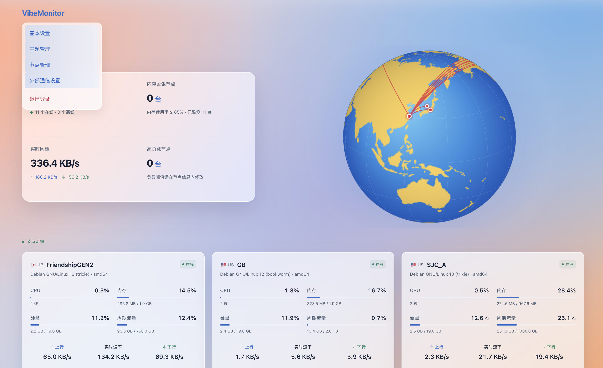
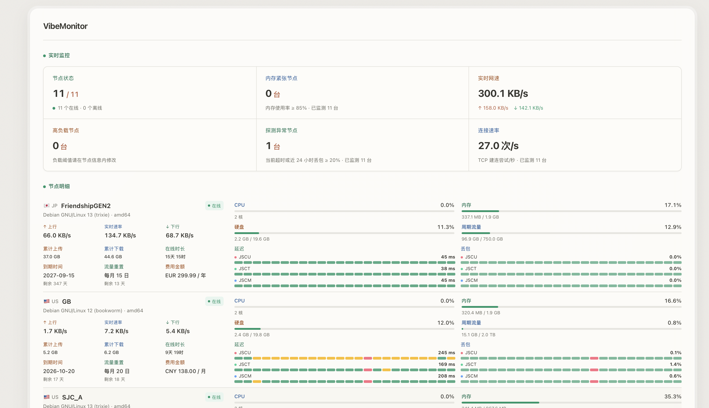
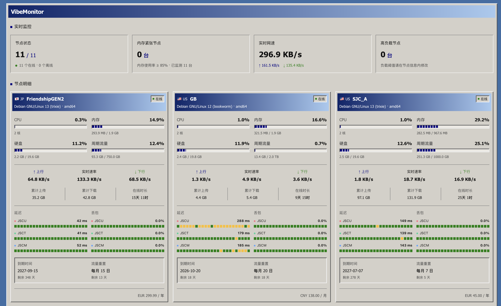
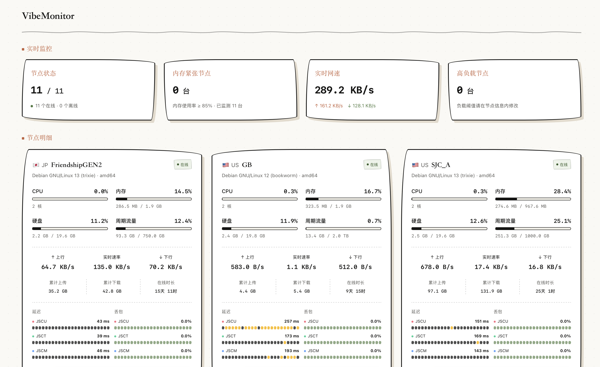

# VibeMonitor

面向IPV4 & Linux x86-64/ARM64的轻量服务器监控程序。

## 功能

- 节点状态、实时网速、高负载节点、内存紧张节点、探测异常节点和 TCP 连接速率总览;
- 每个节点可单独设置CPU负载阈值；未设置阈值的节点不计入高负载统计;
- 账单周期与流量统计,首个周期可自定义已使用流量;
- 单用户管理员登录,点击网站标题进入管理菜单;
- 可添加,编辑或删除节点,并维护测速目标;
- 探针安装命令在「节点管理 → 编辑现有节点 → 显示安装命令」中获取;
- 无插件,不提供远程控制或文件管理;
- 安装脚本自动反代域名;
- 外部通信支持telegram bot报警;
- 每个节点可设置流量预警基准（百分比）：达到配额的指定比例时通过 Telegram 提前提醒，每个账期最多一次；0 或留空关闭提前预警，原有超额报警保留。需设置流量配额并开启 Telegram 告警;
- 报警信息自定义;
- 实时速率(带宽)履历查询,曲线与ping值履历一样;
- 节点按自定义顺序排序;
- 一级菜单“主题管理”：保留现有外观为默认主题，支持上传、选择和删除自定义 CSS 主题包；


## 界面预览






## 安装与更新

支持 Linux x86-64 / ARM64，使用 systemd。运行安装脚本后，选择 **1. 安装主控**；以后更新主控选择 **2. 更新主控**，会保留账号、节点和历史数据。

```bash
curl -4 -fsSL -o install.sh https://raw.githubusercontent.com/M48A1/vibemonitor/main/install.sh && bash install.sh
```

安装主控时填写域名，脚本会配置 Nginx HTTP 反向代理、申请 HTTPS 证书并启用自动续期。留空域名时使用原有的直接端口访问方式。探针填写最终的主控访问地址。


